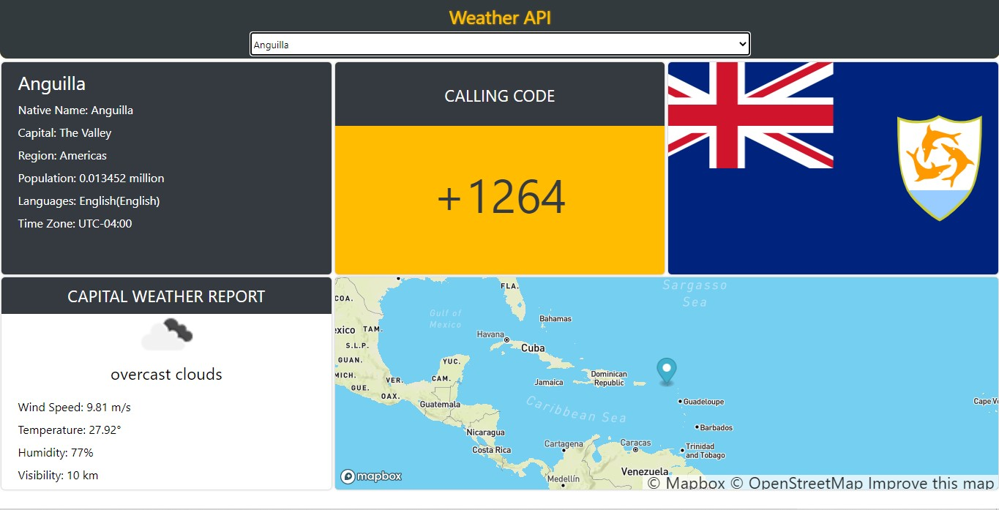
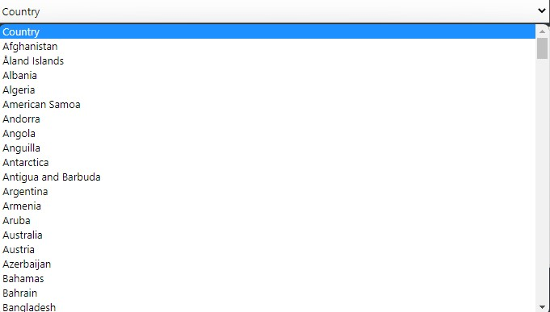
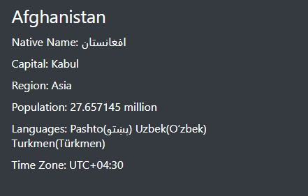
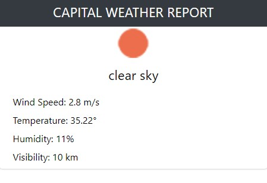
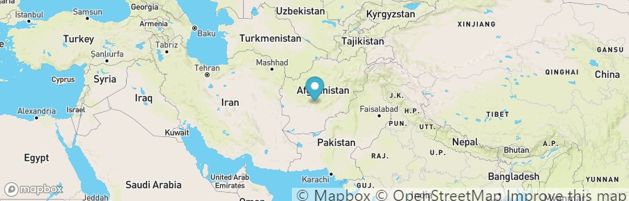

# Weather API 
This is an implementation of multiple API's to create a nicely working weather app. 

### Features
- list of all countries  
  this app gets the list of all countries from reliable and stable API and on every load of page the list gets updated by ***Ajax*** request.

  

- General knowledge  
  - informations like native name, capitals name and etc.

    
  - call code

    

  - countries flag

    

- Weather   
  weather report of each countries capital, comes from different API than general informations.

  

- Map & Location  
  location of countries capital is shown from specific API which gives interesting look to this app.

    